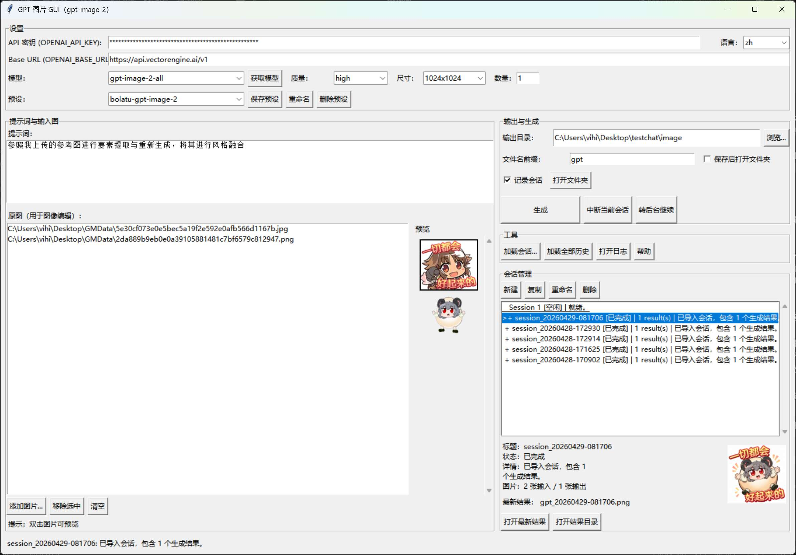

# GptImage2-APIGUI

Quick language switch: [中文](#中文) | [English](#english)

## GUI Preview



## 中文

一个面向 OpenAI 兼容 **图像生成 / 图像编辑** API 的 Windows GUI，支持自定义 provider `base_url`、连接预设、多会话工作流和打包 `.exe` 发布。

### 功能特性

- 文生图与图生图
- 支持通过自定义 `base_url` 接入 OpenAI 兼容 provider
- 支持保存 / 重命名 / 删除连接预设，并记住当前激活预设
- 支持从 provider 拉取模型列表并在界面中快速筛选模型
- 多会话工作流，支持并行生成任务
- 支持中断当前会话，或将正在运行的会话转到后台继续
- 支持会话复制、重命名、删除与导入
- 启动时自动加载最近历史会话，也支持手动加载全部历史
- 双语 UI（`zh` / `en`），并记住上次语言设置
- 支持原图与最新生成结果的缩略图预览
- 可选将会话记录到 `sessions/`
- 错误日志写入 `logs/app.log`
- 外部 `config.json` 配置文件（不存在时自动创建）

### 从源码运行

#### 1) 创建虚拟环境并安装依赖

```powershell
python -m venv .venv
.\.venv\Scripts\python -m pip install --upgrade pip
.\.venv\Scripts\python -m pip install openai pillow
```

#### 2) 创建配置文件

将 `config.example.json` 复制为 `config.json`，然后填写你的配置：

- `api_key`: 你的 API key
- `base_url`: OpenAI 兼容接口地址（通常以 `/v1` 结尾）
- `model`: 图像模型名称
- `out_dir`: 输出目录
- `ui_language`: 可选，`zh` 或 `en`
- `connection_presets_json`: 可选，保存多个 provider 连接预设
- `active_preset`: 可选，启动时自动应用的预设名称

#### 3) 启动

```powershell
.\.venv\Scripts\python .\GptImage2-APIGUI.py
```

### 打包

```powershell
.\.venv\Scripts\pyinstaller --clean --noconfirm "GptImage2-APIGUI.spec"
```

输出文件：

- `dist/GptImage2-APIGUI.exe`

### 使用流程

- 在主编辑区准备当前活动会话的参数
- 如有需要，可先保存连接预设，或先点击“获取模型”同步服务端模型列表
- 在右侧会话管理区创建更多会话
- 多个会话可并行运行；每个会话都有自己的提示词、图片、状态和输出结果
- 运行中的会话可直接中断，或转后台后继续编辑新的会话
- 双击原图或生成结果缩略图可直接打开预览

### v1.2.0 更新

- 新增连接预设管理，可持久保存多个 API 配置
- 新增模型列表拉取与模型快速筛选
- 新增会话中断与转后台继续能力
- 补充 GUI 截图与更完整的 `venv` 打包说明

### 说明与排错

- 如果出现错误，请查看 `logs/app.log`
- 如果 provider 返回 **HTML** 或非 JSON，通常说明 `base_url` 不正确（不是 API 端点）或缺少 `/v1`
- 有些 provider 返回 `b64_json`，有些返回图片 `url`，有些返回 `data:image/...;base64,...`；本工具兼容这三种格式
- 启动时会自动从 `sessions/` 导入最近会话文件

### 安全说明

不要把 `config.json` 提交到 git。本仓库默认会忽略它。

## English

A Windows GUI for OpenAI-compatible **image generate / edit** APIs, with support for provider `base_url` endpoints, saved connection presets, multi-session workflow, and packaged `.exe` releases.

### Features

- Text-to-image and image-to-image generation
- OpenAI-compatible provider support via custom `base_url`
- Save / rename / delete connection presets and remember the active preset
- Fetch provider model lists and quickly filter models from the UI
- Multi-session workflow with parallel generation tasks
- Interrupt the current session or move a running session to the background
- Session duplication, rename, deletion, and session import
- Automatic loading of recent session history, plus manual load-all history
- Bilingual UI (`zh` / `en`) with remembered language setting
- Thumbnail preview for source images and latest generated result
- Optional session recording to `sessions/`
- Logs written to `logs/app.log`
- External `config.json` (auto-created if missing)

### Run from source

#### 1) Create venv & install deps

```powershell
python -m venv .venv
.\.venv\Scripts\python -m pip install --upgrade pip
.\.venv\Scripts\python -m pip install openai pillow
```

#### 2) Create config

Copy `config.example.json` to `config.json` and fill your settings:

- `api_key`: your API key
- `base_url`: OpenAI-compatible base url (usually ends with `/v1`)
- `model`: image model name
- `out_dir`: output directory
- `ui_language`: optional, `zh` or `en`
- `connection_presets_json`: optional, stores multiple provider presets
- `active_preset`: optional preset name to auto-apply on startup

#### 3) Start

```powershell
.\.venv\Scripts\python .\GptImage2-APIGUI.py
```

### Build

```powershell
.\.venv\Scripts\pyinstaller --clean --noconfirm "GptImage2-APIGUI.spec"
```

Output:

- `dist/GptImage2-APIGUI.exe`

### Workflow

- Use the main editor to prepare the currently active session
- Optionally save a connection preset or fetch the latest model list first
- Create additional sessions from the right-side session manager
- Run multiple sessions in parallel; each session keeps its own prompt, images, status, and outputs
- Interrupt a running session or send it to the background while continuing in a new session
- Double-click source images or generated result previews to open them

### v1.2.0 Highlights

- Added persistent connection preset management for multiple API endpoints
- Added provider model fetching and in-UI model filtering
- Added session interrupt and send-to-background workflow
- Updated documentation and added the latest GUI screenshot

### Notes / Troubleshooting

- If you see errors, check `logs/app.log`.
- If your provider returns **HTML** or non-JSON, it usually means the `base_url` is wrong (not an API endpoint) or missing `/v1`.
- Some providers return `b64_json`, some return image `url`, and some return `data:image/...;base64,...`; this app handles all three formats.
- Recent session files are auto-imported on startup from `sessions/`.

### Security

Do **NOT** commit `config.json` to git. This repository ignores it by default.
